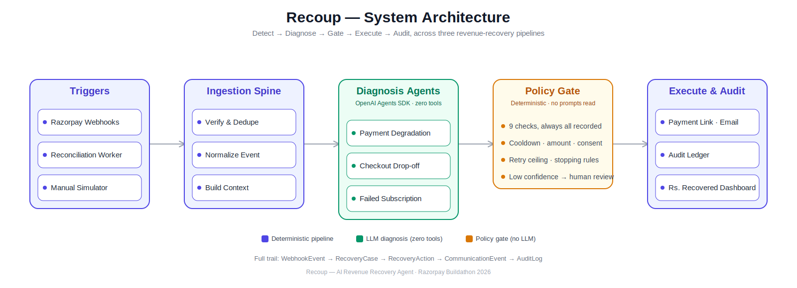

# Recoup

Detects revenue at risk, diagnoses why, and executes a recovery action that a deterministic policy gate has approved.

Recoup is an AI agent system built for the Razorpay Buildathon's AI Revenue Recovery track. It watches three ways a payment stack quietly loses money — a payment that fails, a checkout that is abandoned, a subscription renewal that declines — and opens a recovery case for each one. An LLM agent reads the assembled context and proposes a diagnosis and a single recovery action; a deterministic policy gate written in plain code then decides whether that action is allowed to run at all. Every stage, including the ones that stop an action, is appended to an audit ledger you can read back case by case.

## How it works

All three pipelines share the same shape and differ only in the agent stage. A **trigger** decides whether a normalized database row qualifies to open or reuse a recovery case. **Context** assembles one plain object: the triggering data, the customer's history, cross-pipeline cooldown status, and prior attempts. The **agent** makes a single LLM call — structured input in, structured JSON out, with zero tools, so it has no way to reach an executor. The **gate** evaluates that JSON against nine hard rules and records the result of every one. **Execute** runs only if the gate returned allow. **Audit** appends a row for each stage above.

### Payment Degradation

Triggered by a real `payment.failed` webhook from Razorpay. The agent reads the failed payment's error code, error reason and method, the customer's recent payment history, and any prior recovery attempts on the case, then returns a diagnosis of `gateway_timeout`, `insufficient_funds`, `bank_decline`, `risk_block` or `other`. It can propose sending a payment link, retrying on an alternate route, escalating to a human, or doing nothing.

### Checkout Drop-off

Triggered by the reconciliation worker rather than a webhook — it finds checkout sessions stuck in `created` or `attempted` past the abandonment threshold and fetches authoritative order state from Razorpay. The agent reads cart value, items, the payment method selected and the customer's prior abandonment count, and diagnoses `friction`, `price_hesitation`, `payment_method_issue` or `no_clear_cause`. Doing nothing is a first-class option here, not a fallback.

### Failed Subscription

Triggered by a subscription renewal charge failing. The agent reads `authAttempts`, `chargeAt`, the last failure code and reason, plan value, and how much of the plan has already been paid, then diagnoses `transient_failure`, `stale_payment_method` or `churn_signal`. It can request a card update, send a payment link, escalate, or do nothing — never a retry, because Razorpay owns retry timing and the agent only proposes the parallel communication track.

## FAQ

**What does Recoup actually do?**

It watches for payments, checkouts, and subscriptions that are about to lose you money, figures out why, and tries to win the sale back automatically.

**Is this connected to real money?**

It runs on Razorpay's test mode, so every action is real infrastructure; just no real cash changes hands.

**Will it actually email customers?**

Yes, every recovery action that gets approved sends a real email, using a real Razorpay payment link.

**What stops it from spamming someone?**

A set of rules: Cooldowns, Spend limits, and Confidence checks - block or hold any action before it reaches a customer. You can see exactly which rule fired for every case on the Audit page.

**Can I try it myself?**

Yes, head to the Simulator, pick a scenario, and watch the full detect, diagnose, decide, execute loop run in real time.

## Tech stack

- **Next.js 16** with React 19 and TypeScript, App Router
- **Tailwind CSS v4** configured entirely in `app/globals.css`, with shadcn/ui on Radix primitives
- **Prisma 6** against Postgres on Neon, using the pooled-plus-direct connection pattern
- **OpenAI Agents SDK** (`@openai/agents`) for the three diagnosis agents, with Zod schemas as the structured output contract
- **Razorpay** for orders, payment links, plans and webhooks
- **Resend** for recovery email
- **TanStack Query** for the polling and filtered read surfaces, **motion** for animation, **Recharts** available for charting

## Live demo

[recoup-rzp.vercel.app](https://recoup-rzp.vercel.app) — start at [/simulator](https://recoup-rzp.vercel.app/simulator), which drives all three pipelines against real Razorpay test-mode infrastructure and shows each run's detect, diagnose, gate and execute trail as it happens.

## License

[MIT](./LICENSE)
